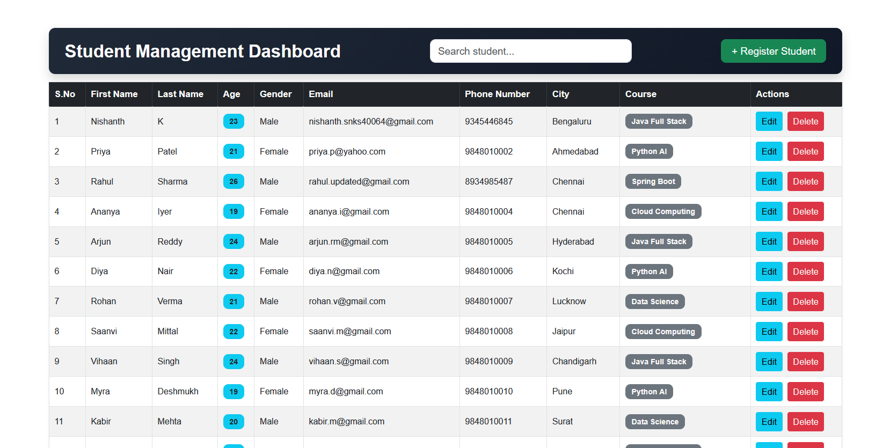
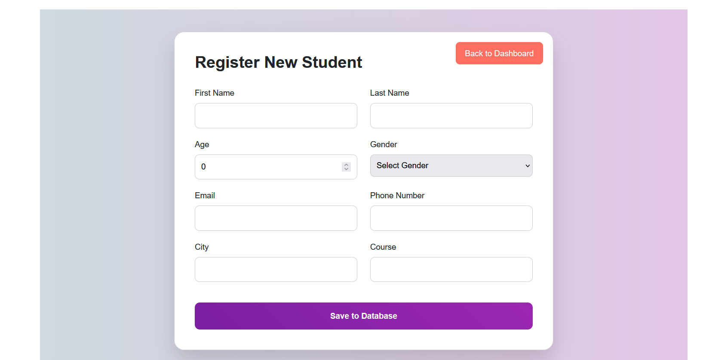
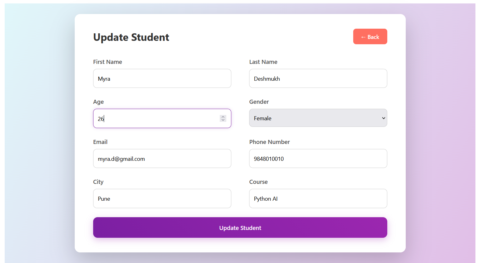
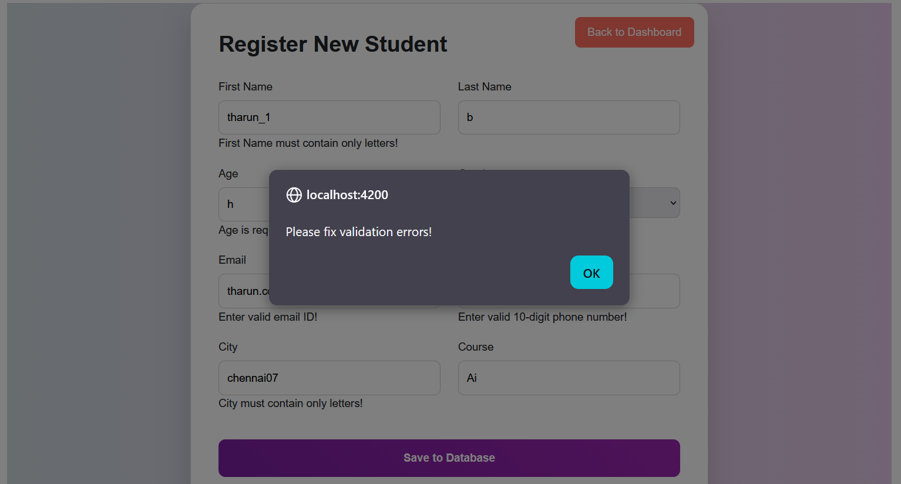

# 🎓 Student Management System

A full-stack web application designed to manage student records efficiently with complete CRUD operations, real-time validation, and a user-friendly interface.

---

## 🚀 Tech Stack

* **Frontend:** Angular, TypeScript, HTML, CSS
* **Backend:** Java, Spring Boot (REST APIs)
* **Database:** SQL Server (SSMS)
* **Tools:** Git, GitHub

---

## ✨ Features

* 🏠 Dashboard displaying student records
* ➕ Add new students with form validation
* ✏️ Update existing student details
* 🗑️ Delete student records
* 🔍 Search and filter students
* ✅ Input validation with real-time error messages
* ⚠️ User-friendly alerts for invalid data

---

## 🏗️ Application Flow

```
Frontend (Angular UI)
        ↓
REST API Calls (HTTP)
        ↓
Backend (Spring Boot)
        ↓
Database (SQL Server)
```

---

## 📸 Screenshots

### 🏠 Dashboard



---

### ➕ Add Student



---

### ✏️ Update Student



---

### ⚠️ Validation Example



---

## ⚠️ Validation & Error Handling

### ➕ Create Form Validation Errors


* Displays real-time validation messages for invalid inputs
* Prevents submission when required fields are missing
* Highlights incorrect fields clearly for users

---

### ✏️ Update Form Validation Errors


* Ensures updated data meets validation rules
* Prevents incorrect updates to the database
* Improves data integrity and user experience

---

## ⚙️ Getting Started

### Prerequisites

* Java 17+
* Node.js & Angular CLI
* SQL Server (SSMS)

---

### 🔧 Backend Setup

```bash
git clone https://github.com/Nishanth4063/student-project
cd student-backend
```

Update database configuration in `application.properties`, then run:

```bash
./mvnw spring-boot:run
```

---

### 💻 Frontend Setup

```bash
cd student-frontend
npm install
ng serve
```

Open: http://localhost:4200

---

## 📡 API Endpoints

| Method | Endpoint         | Description        |
| ------ | ---------------- | ------------------ |
| GET    | `/students`      | Get all students   |
| POST   | `/students`      | Create new student |
| PUT    | `/students/{id}` | Update student     |
| DELETE | `/students/{id}` | Delete student     |

---

## 🧠 Key Highlights

* Built a complete full-stack application from scratch
* Implemented frontend and backend validation
* Designed clean UI with proper error handling
* Integrated Angular with Spring Boot using REST APIs
* Managed database operations using SQL Server

---

## 👨‍💻 Author

**Nishanth**
🔗 https://github.com/Nishanth4063

---

⭐ If you like this project, consider giving it a star!
